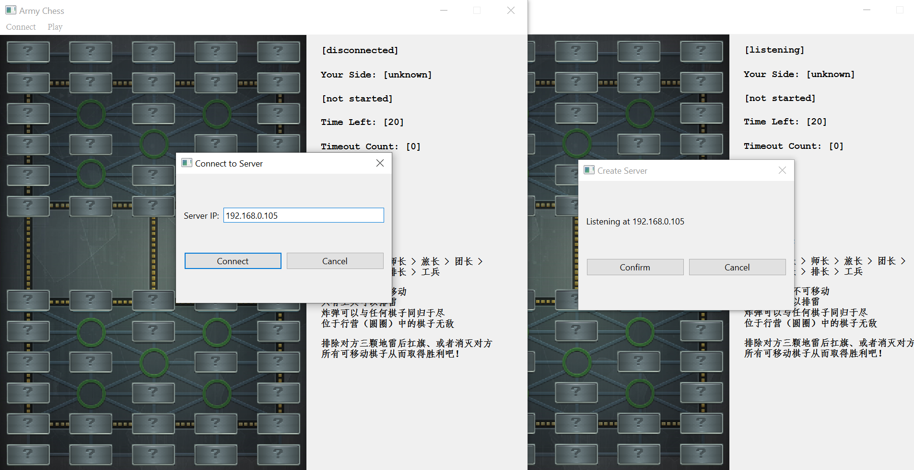
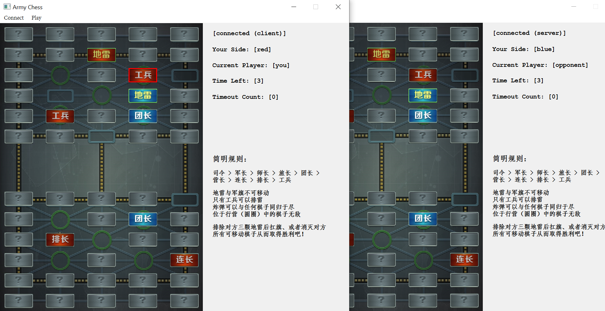
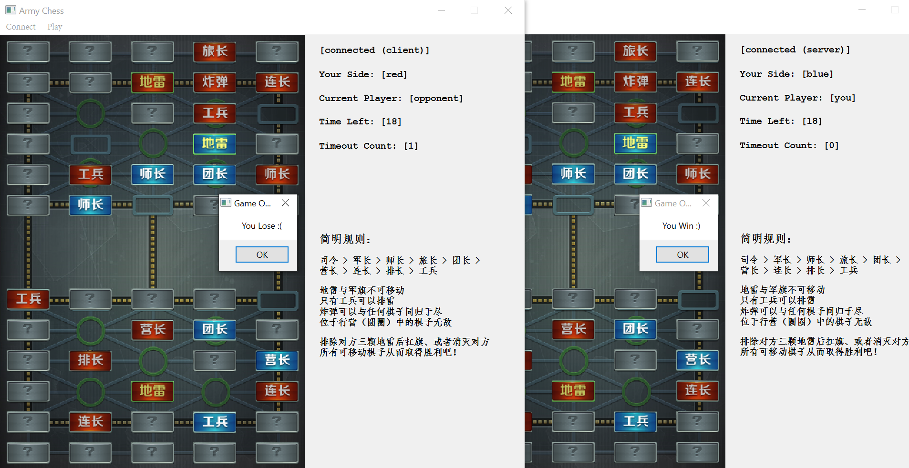

# ArmyChess

This is my project (#1) for the summer semester (30240522-3) in Tsinghua University. Mainly focused on Qt and Internet programming.

Author: [Ren Zihou](https://github.com/RenZihou)

## Build

`MinGW 8.1.0` (your c++ compiler) and `Qt6` is required, and `Qt 6.1.2` is recommended 
(because it is used for development, and I haven't tested it on any other versions).

This program supports both `cmake` and `qmake`.

### Using cmake

```
> cmake -S . -B build -G "MinGW Makefiles" -DCMAKE_BUILD_TYPE=Release
> cmake --build build
```

### Using qmake

```
> mkdir build
> cd build
> qmake ..
> make
```

## Develop Progress

### Interface

- [x] main window & menu bar - 2021/08/16
- [x] board & chess - 2021/08/17
- [x] board synchronization - 2021/08/19

### Connection

- [x] connection - 2021/08/19
- [x] disconnection - 2021/08/19

### Rules

- [x] init board and chess - 2021/08/17
- [x] flip chess - 2021/08/17
- [x] move chess - 2021/08/20
- [x] eat chess - 2021/08/20

### Victory

- [x] judge victory - 2021/08/22
- [x] timeout - 2021/08/22
- [x] pop-up window - 2021/08/22

## Change Log

### v1.3.2

**Fix bug**

* Soldier cannot move across border now

### v1.3.1

**Fix bug**

* game now correctly stop when all soldiers are killed

### v1.3.0

**Add**

* highlight opponent's move

### v1.2.2

**Fix bug**

* chess won't move slightly when selected now

### v1.2.1

**Add**

* new cheat command `freeze` will pause the game

### v1.2.0

**Fix bug**

* cancel listening before connection would crash the game

**Code Implement**

* add debug output: connection failed

### v1.1

**Optimization**

* ip check
* timeout counts
* game tips

**Fix bug**

* game now stop correctly after a victory

### v1.0

First full game

## Snapshots






