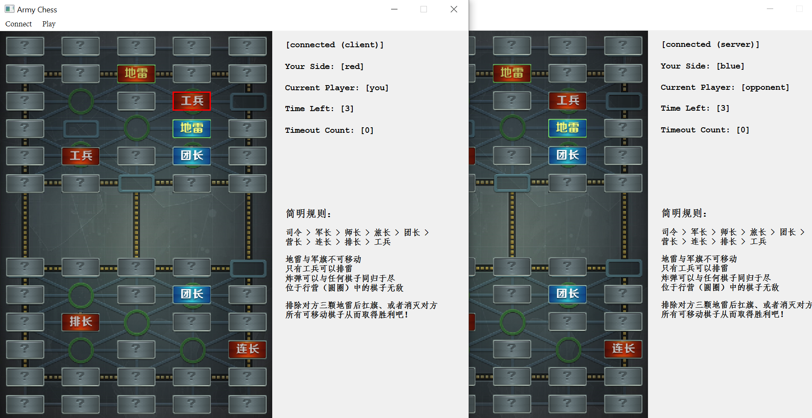

# 军棋

清华大学计算机系 $2021$ 年夏季小学期项目

程序及文档作者：任自厚 $2020012366$

***

## 编译

本项目开发使用`MinGW 8.1.0`与`Qt 6.1.2`，因此推荐使用这两个版本以免出现编译错误。如使用`Qt 5.x.x`，还需相应修改`CMakeLists.txt`

本项目支持使用`cmake`或`qmake`编译，方法如下：

### 使用 cmake

在项目根目录开启命令行，执行如下命令：

```
> cmake -S . -B build -G "MinGW Makefiles" -DCMAKE_BUILD_TYPE=Release
> cmake --build build
```

编译好的可执行文件将会保存于`./build`目录

### 使用 qmake

与`cmake`的使用类似，在项目根目录执行如下命令：

```
> mkdir build
> cd build
> qmake ..
> make
```

编译好的可执行文件将会保存于`./build/release`

### 打包

编译好的`.exe`程序依赖于大量`.dll`扩展，如要打包为独立的可执行文件以便于分发，需执行如下步骤：

1. 将以`Release`模式编译的`.exe`程序拷贝到一个空文件夹中
2. 在上述目录执行命令行：`windeployqt .\ArmyChess.exe`
3. 运行 [Enigma Virtual Box](https://enigmaprotector.com/en/downloads.html)，将输入文件选择为上面的`.exe`文件，并递归添加上面的文件夹，进行打包，默认输出文件应为`ArmyChess_boxed.exe`

## 运行游戏

双击编译好的可执行文件即可开始游戏。由于需要网络通信，请确保您开启了相应的防火墙权限

### 联机

1. 任意一方点击`Connect - Create Server`，屏幕上显示`ip`地址，启动服务器并开始监听，点击`Confirm`关闭对话框（点击`Cancel`会取消监听并停止服务器）
2. 另一方点击`Connect - Connect to Server`，输入服务器的`ip`地址，点击`Connect`进行连接，连接成功后对话框自动关闭，输入无效地址会有弹窗提示
3. 连接成功后，双方界面右上角均会显示`[connected]`并标明服务端或客户端，此时双方的`Play - Start`按钮变为可点击状态，双方均选择开始游戏后会正式启动游戏

### 游戏（规则说明）

使用“翻棋”规则，游戏界面含有简明规则显示

## 设计文档

### 双端工作流程

**未连接阶段**：即刚进入程序的状态，游戏相关按键不可用，只可选择创建或连接服务器

* 创建服务器：在本地开启一个服务器并监听指定端口（端口号写在项目文件的宏定义`PORT`中），等待连接，此时不可再选择连接服务器，除非取消服务器监听
* 连接服务器：试图连接输入`ip`的服务器，此时不可再选择创建服务器，除非取消连接服务器

**未开始阶段**：双方已经建立连接，但未开始游戏，屏幕上显示`[not started]`。此时可以通过开始游戏按键申请开始游戏，屏幕上会显示`[waiting opponent]`，若对方也开始游戏，则会进入游戏阶段

**游戏阶段**：倒计时开始，并显示当前是哪方的回合。若为己方回合，游戏会对合法点击事件做出响应（如下）；若为对方回合，则对一切点击事件不做响应

* 点击未翻开棋子：视为翻棋，翻开棋子并试图判定双方持方（红蓝），成功判定后发送相关信号
* 点击己方棋子：视为选择棋子，此时棋子会高亮显示
* 点击对方棋子：若已经点击过己方棋子，视为吃子，按规则判定是否可以到达、是否可吃，结果分为非法操作（不可到达或不允许的吃子）、己方被吃、同归于尽、对方被吃
* 点击空白棋子（占位符）：若已经点击过己方棋子，视为移动，按规则判定是否可以到达

除此之外，还有若干判定逻辑：

* 倒计时结束：视为超时，转换回合持方并记录超时，超时三次判输
* 没有可移动棋子：判输

**结束阶段**：胜负已经判定，游戏终止，对点击事件不再响应

### 通信协议

本项目采用`TCP`网络通信协议。

报文格式：报文为字符串，记录指令。下面为全部指令：

| 指令语法                   | 指令含义                                               | 可用于作弊[^1] |
| -------------------------- | ------------------------------------------------------ | -------------- |
| `seed <s>`                 | 以`<s>`为种子重绘初始地图（用于同步棋盘）              | 否             |
| `start`                    | 发信方申请开始游戏                                     | 否             |
| `reveal <x> <y>`           | 翻开`(<x>, <y>)`坐标棋子                               | 是             |
| `kill <x> <y>`             | 杀死`(<x>, <y>)`坐标棋子                               | 是             |
| `move <x1> <y1> <x2> <y2>` | 移动`(<x1>, <y1>)`坐标棋子到`(<x2>, <y2>)`坐标（空白） | 是             |
| `highlight <x> <y>`        | 高亮`(<x>, <y>)`坐标棋子[^2]（用于显示对方步骤）       | 是             |
| `freeze`                   | 冻结计时器，再次输入时恢复计时                         | 是             |
| `side <s>`                 | 发信方已经决定持方为`<s>`                              | 是             |
| `finish`                   | 结束发信方回合                                         | 是             |
| `win`                      | 判发信方赢                                             | 是             |
| `lose`                     | 判发信方输                                             | 是             |

[^1]: 即在作弊框内输入指令时，程序会做响应
[^2]: 最多同时仅有一个棋子被高亮，后一个会覆盖前一个显示

接收方收到报文后，会调用`Board::exec(const QString &)`执行指令，实现棋盘的同步

### 信号与槽机制设计

**游戏逻辑相关**：这一部分的信号传递存在于棋子`ChessLabel`类与游戏主体`Board`类之间，用于实现游戏逻辑

* 棋子点击事件：棋子重载了`mousePressEvent(QMouseEvent *)`函数，发生点击事件时会发出`ChessLabel::chessClicked(ChessLabel *)`信号，参数为被点击棋子的指针，由`Board::chessClicked(ChessLabel *)`接收，进行响应
* 棋子被吃事件：当一个棋子被吃（调用`ChessLabel::kill()`函数），且为己方可移动棋子时，发出`ChessLabel::soldierKilled()`信号，由`Board::soldierKilled()`接收，记录己方被吃个数，从而判断是否所有可移动棋子被吃

**网络信息传输相关**：这一部分的信号传递存在于游戏主体`Board`类与主程序`MainWindow`类之间，用于向对方发送网络报文

* 发送指令报文：当棋盘发生改变，会发出`Board::stepProceeded(const QString &)`信号，参数为执行的指令，由`MainWindow::send(const QString &)`接收，并将指令传输给对手
* 接收指令报文：当收到对方传来的信号，`socket`会发出`QTcpSocket::readyRead()`信号，由`MainWindow::receive()`接收，读取报文并执行指令

**显示相关**：这一部分的信号传递存在于游戏主体`Board`类与主程序`MainWindow`之间，用于随时调整主界面的显示信息

* 持方显示：当`Board`决定出玩家持方，会发出`Board::sideChanged(int)`信号，参数为玩家持方，由`MainWindow::changeSide(int)`接收，从而在主界面上调整持方显示
* 倒计时显示：当`Board`下的`timer`计时器发出一秒钟计时信息，`Board`会处理信号并发出`Board::timeChanged(int)`信号，参数为本轮剩余时间，由`MainWindow::setTime(int)`接收，从而在主界面上调整倒计时显示
* 超时显示：当本轮超时，`Board`会发出`Board::timeOut(int)`信号，参数为累计超时次数，由`MainWindow::timeOut(int)`接收，从而在主界面上调整超时次数显示

### GUI 界面设计

```
MainWindow
|
+---Board
|   \----ChessLabel
|
+---connectionLabel
+---sideLabel
+---turnLabel
+---timeLabel
+---timeoutLabel
+---tipsLabel
|
\---menuBar
```

主界面分为三部分：

* 棋盘`Board`，为自定义的`QWidget`派生类对象，负责棋盘、棋子的绘制以及游戏逻辑的处理
* 显示标签，为若干的`QLabel`对象，显示了连接状态、持方信息、倒计时以及规则说明等
* 菜单栏，操作连接、游戏开始等

此外，创建服务器与连接服务器也有各自的可视化界面（对话框形式）

### 项目亮点

* 作弊指令：玩家可以在开启作弊（由编译时的宏定义控制，避免影响正常游戏平衡）的情况下手动输入多种指令，便于调试以及功能体验
* 对方走棋同步高亮：便于了解对方行动，优化玩家体验
* 完善的代码注释：所有类成员函数均进行了`JSDoc`风格的注释，同时也有充足的行间注释，便于他人识别以及后期维护和更新
* 使用`qDebug()`进行必要的日志记录，包括连接状态变更、用户点击事件、信息收发及关键事件记录等，便于程序调试

## 游戏截图

连接服务器与监听：


游戏进行：



游戏结束（胜负判断）：


